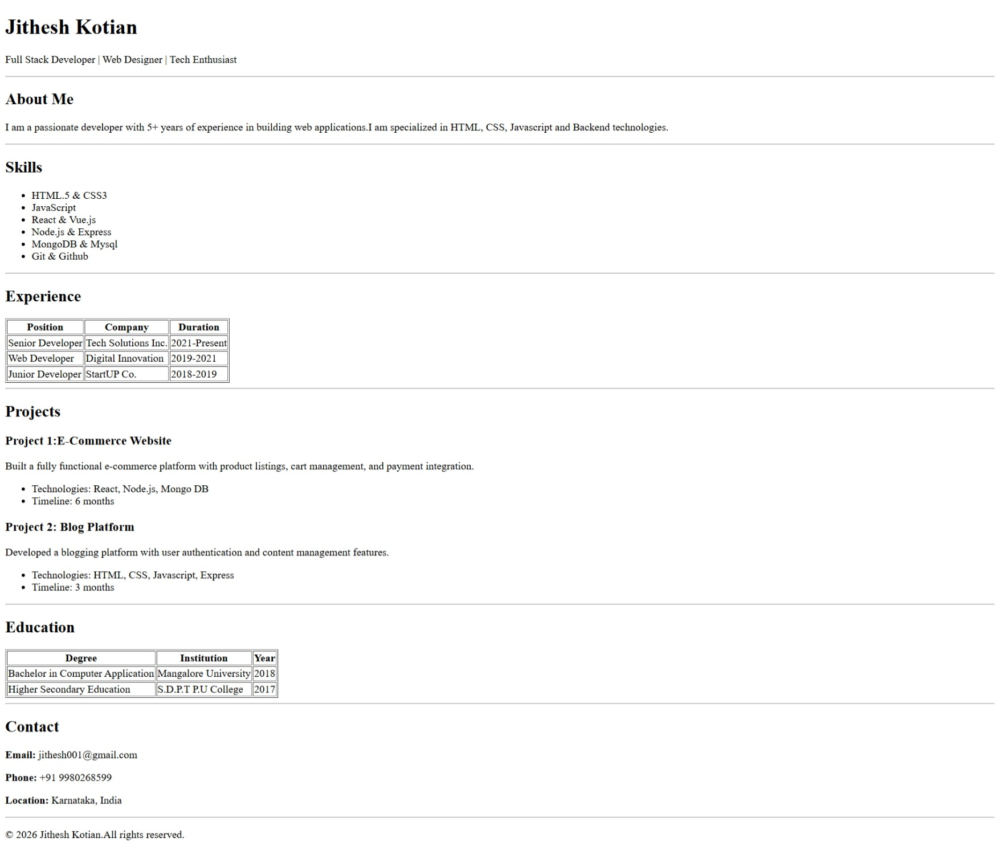

# HTML Resume Website

## Description
This project is a personal resume website built using *HTML*.  
The project displays personal and professional information in a structured format.

## Live Demo
https://jitheshkotian-08.github.io/Html-Resume/

## Technologies Used
- HTML5

## Setup Instructions
1. Clone the repository:
   ```bash
   git clone https://github.com/Jitheshkotian-08/Html-Resume.git
2. Open the project folder
3. Open index.html in any web browser

## Usage
- View resume details
- Scroll through different sections of the resume

## Screenshots


## Author
Jithesh Kotian